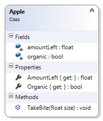

# Exercise 8: Apple Class

This is an exercise for the coursera course [More C# Programming and Unity](https://www.coursera.org/learn/more-programming-unity)

### The Problem

Implement the fields and properties for the Apple class from the previous exercise. Here’s the class diagram as a reminder:

## Installation
To install, follow these steps:

Via Downloading from GitHub:

Download this repository onto your machine by clicking the "Clone or Download" button or Fork the repo into your own Github account
Download and extract the zip file to a directory of your choice.  

Via command line:

`$ git clone https://github.com/puglisac/coursera c-sharp-2-apples.git`

Open the file "AppleExample.sln"